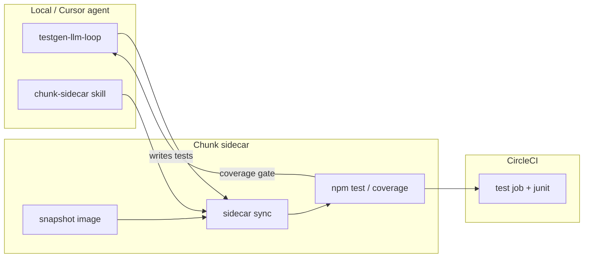

# demo-hono-test-gen-llm

A small **Hono** API on Cloudflare Workers used as a **dual experiment sandbox**:

1. **TestGen-LLM (Meta, 2024)** — encoded as a Cursor agent skill that iteratively extends an *existing* test suite with machine-gated acceptance.
2. **[Chunk sidecar](https://circleci.com/)** (CircleCI preview) — remote Linux environments for sync → test → validate, without relying on the laptop as the source of truth for CI-like feedback.

The app itself is intentionally simple (datetime helpers, timezone conversion, business-day counting). The interesting part is the **workflow around it**: agent skills, friction logs, partial-coverage fixtures, and CircleCI wiring.

## Why this repo exists

| Layer | Question being explored |
|-------|-------------------------|
| **testgen-llm-loop** | Can paper-grade test improvement (compile → run → coverage gain → dedupe → flakiness) be reproduced in Claude Code / Cursor without a bespoke Meta pipeline? |
| **chunk-sidecar** | Can agents run the same loop on a remote sidecar (TDD red/green, coverage, PR validation) when local envs differ or `chunk validate` is awkward? |
| **Together** | Does pairing *LLM test iteration* with *remote validation* surface new friction (org IDs, snapshots, sync, non-interactive CLI) that pure local testgen misses? |

Session outcomes and pitfalls are documented in **[Friction logs](#friction-logs)** — treat them as the lab notebook, not optional README fluff.

## Stack

- **Runtime**: Cloudflare Workers (`wrangler`)
- **Framework**: [Hono](https://hono.dev/)
- **Dates**: [Luxon](https://moment.github.io/luxon/)
- **Tests**: [Vitest](https://vitest.dev/) + V8 coverage
- **CI**: CircleCI (`.circleci/config.yml`) + Chunk (`.chunk/config.json`)

## Agent skills (the experiments)

Skills live under [`.cursor/skills/`](.cursor/skills/). Invoke them in Cursor (e.g. `/testgen-llm-loop`, `/chunk-sidecar`) or let the agent pick them up from natural-language triggers.

### `testgen-llm-loop`

Implements the core ideas from Meta’s paper [*Automated Unit Test Improvement using Large Language Models at Meta*](https://arxiv.org/abs/2402.09171) (TestGen-LLM, 2024):

- **Scope**: extend existing tests only — no greenfield suite design or framework swaps.
- **Acceptance**: mechanical — a candidate must compile, pass, **increase coverage** on the target, and be non-duplicate; optional flakiness reruns.
- **Feedback**: rejected tests are fed back into the next iteration so the agent does not repeat the same failures.

Phases: target selection → context → baseline coverage → generate → 4-criteria filter → flakiness → feedback → PR.

See [`.cursor/skills/testgen-llm-loop/SKILL.md`](.cursor/skills/testgen-llm-loop/SKILL.md) and `references/` for filter criteria and prompt patterns.

### `chunk-sidecar`

Drives the **sync → validate** loop on a CircleCI-provisioned sidecar:

- Create or restore from `validation.sidecarImage` in `.chunk/config.json`
- `chunk sidecar sync` mirrors the repo to `~/workspace/<repo>`
- Run `npm test`, coverage, and setup on the remote VM (useful when local Node/CI differ or when validating before push)

See [`.cursor/skills/chunk-sidecar/SKILL.md`](.cursor/skills/chunk-sidecar/SKILL.md).

### How the two experiments combine



Typical session flow documented in the friction logs:

1. Bootstrap sidecar (`chunk sidecar create --org-id …`, Node snapshot).
2. Run **testgen** against a file with real coverage gaps (not already at 100%).
3. Gate candidates on sidecar with `npm run test:coverage`.
4. Open a PR; CircleCI runs the same Vitest suite with JUnit output.

**Deliberate fixture**: after [PR #1](https://github.com/hidetaka-cci/demo-hono-test-gen-llm/pull/1) brought `src/index.ts` to full coverage, [PR #2](https://github.com/hidetaka-cci/demo-hono-test-gen-llm/pull/2) added APIs with **happy-path-only** tests (~70% line coverage) so testgen has room to propose meaningful tests again. See [FRICTION_LOG_PARTIAL_COVERAGE_DEMO.md](./FRICTION_LOG_PARTIAL_COVERAGE_DEMO.md).

## API surface (demo app)

| Method | Path | Purpose |
|--------|------|---------|
| `GET` | `/` | Health text |
| `GET` | `/now` | Current UTC ISO timestamp |
| `GET` | `/today` | Today’s date + days remaining in year |
| `POST` | `/convert-timezone/:tz` | Convert ISO datetime to timezone |
| `POST` | `/business-days` | Count business days in a date range |
| `POST` | `/offset-datetime` | Apply day/hour/minute offset to datetime |

Implementation: [`src/index.ts`](src/index.ts). Tests: [`src/index.test.ts`](src/index.test.ts).

## Getting started

### Prerequisites

- Node.js **22+** (see `package-lock` engines and CircleCI job tag)
- npm
- [Wrangler](https://developers.cloudflare.com/workers/wrangler/) for local dev/deploy
- For sidecar workflows: [Chunk CLI](https://circleci.com/) (`chunk`), CircleCI auth, and org ID in `.chunk/config.json` (non-interactive `chunk sidecar create` requires `--org-id`)

### Install and run locally

```bash
npm install
npm run dev          # wrangler dev
npm test             # vitest run
npm run test:watch
npm run test:coverage   # scoped to src/index.ts
```

### Deploy (Cloudflare)

```bash
npm run deploy
```

### Generate Worker types

```bash
npm run cf-typegen
```

Pass bindings when typing the app:

```ts
const app = new Hono<{ Bindings: CloudflareBindings }>()
```

### Chunk sidecar (quick checklist)

```bash
chunk --version
chunk auth status                    # CircleCI must be valid
git fetch origin
git branch -u origin/main main       # upstream helps sync

# If no snapshot yet (first time):
chunk sidecar create --org-id <YOUR_ORG_ID>
# … install Node/npm on sidecar, then snapshot → set validation.sidecarImage

chunk sidecar sync
chunk sidecar exec -- npm test
```

Org ID and snapshot image in this repo’s committed config are **examples from a real session** — replace with your own org and image IDs.

## CI

[`.circleci/config.yml`](.circleci/config.yml) runs Vitest with JUnit output (`test-results/junit.xml`) on Node 22.22.3, with rerun settings aligned to `.chunk/config.json` gate limits.

[`.chunk/config.json`](.chunk/config.json) defines install/test commands, gate timeout/retries, and optional `validation.sidecarImage` for reproducible sidecars.

## Friction logs

Reproducible agent sessions and known sharp edges:

| Document | Focus |
|----------|--------|
| [FRICTION_LOG.md](./FRICTION_LOG.md) | Combined timeline: sidecar × testgen |
| [FRICTION_LOG_CHUNK_SIDECAR.md](./FRICTION_LOG_CHUNK_SIDECAR.md) | Sidecar-only: create, exec, snapshot, sync |
| [FRICTION_LOG_TESTGEN_LLM_LOOP.md](./FRICTION_LOG_TESTGEN_LLM_LOOP.md) | Testgen-only: filters, coverage, PR #1 |
| [FRICTION_LOG_PARTIAL_COVERAGE_DEMO.md](./FRICTION_LOG_PARTIAL_COVERAGE_DEMO.md) | Intentional ~70% coverage + TDD on sidecar |
| [FRICTION_LOG_TESTGEN_PR3.md](./FRICTION_LOG_TESTGEN_PR3.md) | testgen on ~70% branch → 98% coverage ([PR #3](https://github.com/hidetaka-cci/demo-hono-test-gen-llm/pull/3)) |
| [FRICTION_LOG_ORGID_BOOTSTRAP.md](./FRICTION_LOG_ORGID_BOOTSTRAP.md) | Bootstrapping when `orgID` is missing |

High-signal lessons (details in logs):

- **Non-interactive agents** need `chunk sidecar create --org-id`; org picker UI does not work in Cursor.
- **Bare sidecar images** lack Node/npm — customize, then **snapshot**; recreating without `--image` loses setup.
- **testgen at 100% coverage** converges immediately with zero accepted tests — keep a partial-coverage branch for demos.
- Prefer **`chunk sidecar exec`** for tight TDD loops when `chunk validate` hangs; still use CI for the final gate.

## Repository layout

```
.cursor/skills/
  testgen-llm-loop/     # TestGen-LLM agent loop
  chunk-sidecar/        # Remote validate / TDD
.chunk/config.json      # Chunk commands + sidecar snapshot
.circleci/config.yml    # CircleCI test job
src/index.ts            # Hono app
src/index.test.ts       # Vitest suite (grows via experiments)
FRICTION_LOG*.md        # Session lab notes
```

## References

- Meta TestGen-LLM: [arXiv:2402.09171](https://arxiv.org/abs/2402.09171) — *Automated Unit Test Improvement using Large Language Models at Meta* (2024)
- [Hono](https://hono.dev/) · [Vitest](https://vitest.dev/) · [Cloudflare Workers](https://developers.cloudflare.com/workers/)

## License

Same as the upstream Cloudflare/Hono template used to bootstrap the Worker — check repo defaults if you fork for your own org.
